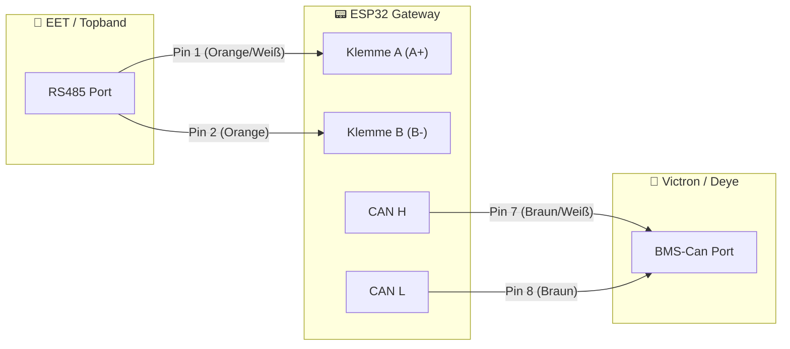

# 🔋 Topband / Victron Gateway V125 "Universal Master"

> **Aktuelle Version / Current Version:** V125 (Stable)  
> **Supported Hardware:** LilyGo T-CAN485, Waveshare ESP32-S3 (Mini & Power/Pro)

**Ein Code für alle Boards. Maximale Sicherheit. Volle Kontrolle.** *One Code to rule them all. Max Safety. Full Control.*

Ein ESP32-basiertes Gateway, das Topband-BMS-Batterien (z.B. **EET, Power Queen, AmpereTime, Redodo**, etc.) über RS485 ausliest, intelligent managt und als natives BMS über CAN-Bus an **Victron GX** (Cerbo, MultiPlus), **Deye** oder **SMA** sendet.

## 📸 Dashboard Preview

Das neue V125 Webinterface (Responsive Design für Mobile & Desktop):


---

## ⚠️ Disclaimer & Warnung

**PRIVATE USE ONLY. NO COMMERCIAL USE.**
- **DIY Projekt:** Dies ist ein privates Open-Source-Projekt. Keine geschäftliche Verbindung zu Herstellern.
- **Auf eigene Gefahr:** Nutzung auf eigenes Risiko. Keine Haftung für Schäden an Batterien oder Hardware.
- **Sicherheit:** DC-Sicherungen sind Pflicht! Falsche Parameter können Akkus zerstören.

---

## 🇩🇪 DEUTSCH / GERMAN

### 🌟 Was ist neu in V125?

<details>
<summary>🔽 <b>Klicken zum Ausklappen: Alle neuen Features & Highlights</b></summary>

#### 1. 🧬 Universal-Architektur
Es gibt keine getrennten Dateien mehr. Du wählst Hardware und Modus einfach oben im Code:
- **Hardware:** `LilyGo T-CAN485` (Klassik) oder `Waveshare ESP32-S3` (Mini/Power).
- **Modus:**
  - `SMART_WIFI`: Volles Programm mit Webinterface, MQTT, Home Assistant & Logging.
  - `SIMPLE_CABLE`: "Stealth"-Modus ohne WLAN. Startzeit < 1 Sekunde, Plug & Play Übersetzung.

#### 2. 🛡️ Sicherheits-Kern "Thermostat"
Schützt LiFePO4-Zellen aktiv vor Frost-Ladung und Überhitzung.
- **Getrennte Limits:** Separate Temperaturen für **Laden** (z.B. >5°C) und **Entladen** (z.B. >-10°C) einstellbar.
- **Profi-Logik:** Wählbar im Menü:
  - **MAX SAFETY (Standard):** Sobald **ein einziger** Sensor die Grenze reißt (z.B. < 5°C), wird das Laden gestoppt.
  - **AVERAGE:** Der Durchschnittswert aller Sensoren wird genutzt (toleranter).

#### 3. 🏠 Smart Home Ready
- **Home Assistant:** 100% Auto-Discovery. Keine YAML-Config mehr nötig.
- **Multi-Protokoll:** Victron (Standard), Pylontech (Deye/Goodwe/Growatt), SMA Sunny Island.

#### 4. 🚦 Status LED 3.0 (Smart Colors)
- 🟣 **Lila:** Verbinde mit WLAN...
- 🔵 **Blau (Pulsierend):** Suche BMS / Scanner-Modus.
- 🟢 **Grün (Atmen):** Alles OK. System läuft.
- 🟡 **Gelb:** Warnung (Zell-Drift oder Limits erreicht).
- 🔴 **Rot (Blitz):** ALARM (Not-Aus / Schutzabschaltung).

#### 5. 🕵️‍♂️ Sherlock & File Manager
- **Spy Mode:** Zeichnet unbekannte Rohdaten auf SD-Karte auf.
- **Web-Manager:** Logs & Dateien direkt im Browser herunterladen/löschen.

</details>

### 🛠️ Installation & Anleitung

Da die V125 universell ist, wird sie vor dem Flashen kurz konfiguriert.

<details>
<summary>🔽 <b>Klicken zum Ausklappen: Schritt-für-Schritt Anleitung</b></summary>

#### 1. Code Konfiguration (WICHTIG!)
Öffne die Datei `sketch.ino` in der Arduino IDE. Ganz oben findest du den Konfigurations-Bereich. Entferne die `//` vor deiner Hardware und deinem Wunsch-Modus:

```cpp
// 1. HARDWARE (Wähle GENAU EINS)
#define BOARD_LILYGO        // <-- Aktivieren für T-CAN485
// #define BOARD_WAVESHARE  // <-- Aktivieren für Waveshare S3 (Mini & Power)

// 2. MODUS (Wähle GENAU EINS)
#define MODE_SMART_WIFI     // <-- Standard (Mit Webinterface & HA)
// #define MODE_SIMPLE_CABLE // <-- Stealth (Kein WLAN, nur Kabel-Übersetzer)
```

#### 2. Arduino IDE Einstellungen
Wähle unter Werkzeuge -> Board die passenden Settings:

| Einstellung      | LilyGo T-CAN485       | Waveshare S3 (Mini & Power) |
|---|---|---|
| Board            | ESP32 Dev Module      | ESP32S3 Dev Module          |
| USB CDC On Boot  | - (egal)              | Enable (Wichtig!)           |
| Flash Mode       | QIO                   | QIO 80MHz                   |
| Partition Scheme | Huge APP (3MB No OTA) | 8MB with Spiffs (oder 16MB) |

Tipp für Waveshare S3: Falls der Upload nicht startet: Halte die Taste BOOT, drücke kurz RESET, lasse BOOT los.

#### 3. Erster Start (Smart Mode)
- Verbinde dich mit dem WLAN `Victron-Gateway-Setup`.
- Öffne `http://192.168.4.1` im Browser.
- Konfiguriere dein Haus-WLAN.
- Wichtig: Gehe danach in Settings -> Profi Mode und prüfe die Zellanzahl (15S oder 16S)!

</details>

### 🔌 Verkabelung (Pinout)

<details>
<summary>🔽 <b>Klicken zum Ausklappen: Anschlussplan & Diagramm</b></summary>

#### Übersichtsschema



#### 1. Batterie zu Gateway (RS485)
- Nimm ein LAN-Kabel, schneide einen Stecker ab. Nutze das ORANGE Paar:
- Pin 1 (Orange/Weiß) an ESP32 RS485 A (A+)
- Pin 2 (Orange) an ESP32 RS485 B (B-)
- Die LED bleibt Blau pulsierend? Tausche A und B!

#### 2. Gateway zu Wechselrichter (CAN)
- Verbinde den CAN-Port des ESP32 mit dem BMS-Can des Wechselrichters.
- ESP32 CAN H an Victron/Deye Pin 7 (Braun/Weiß)
- ESP32 CAN L an Victron/Deye Pin 8 (Braun)
- GND (optional): Pin 3
- Hinweis: Vergiss nicht den Terminator-Widerstand am zweiten CAN-Port des Victron/Deye und aktiviere den DIP-Schalter (120R) am Gateway!

</details>
---

## 🇺🇸 ENGLISH / INTERNATIONAL

### 🌟 What's New in V125?

<details>
<summary>🔽 <b>Click to expand: All new Features & Highlights</b></summary>

#### 1. 🧬 Universal Architecture
No more separate files. One firmware for all hardware, configurable via `#define`:
- LilyGo T-CAN485 (Classic)
- Waveshare ESP32-S3 (Supports Mini & Power/Pro versions)

Modes:
- `SMART_WIFI`: Full features including WebUI, MQTT, HA & Logging.
- `SIMPLE_CABLE`: "Stealth" mode without WiFi. Boot time < 1 sec, plug & play translation.

#### 2. 🛡️ "Thermostat" Safety Core
Protects LiFePO4 cells from frozen charging and overheating.
- Split limits: Separate temperature ranges for Charging (e.g., > 5°C) and Discharging (e.g., > -10°C).
- Selectable logic: Choose in "Expert Mode" between "Max Safety" (Worst sensor rules) or "Average" (Average of all sensors).

#### 3. 🏠 Smart Home Ready
- Home Assistant: 100% Auto-Discovery. No YAML configuration needed.
- Multi-Protocol: Supports Victron (Default), Pylontech (Deye/Goodwe), and SMA Sunny Island.

#### 4. 🚦 Status LED 3.0 (Smart Colors)
- 🟣 Purple: Connecting to WiFi...
- 🔵 Blue (Pulsing): Searching BMS / Scanner Mode.
- 🟢 Green (Breathing): System Healthy / Running.
- 🟡 Yellow: Warning (Cell Drift or Limits reached).
- 🔴 Red (Strobe): CRITICAL ALARM (Cutoff / Overheat).

</details>

### 🛠️ Installation & Guide

<details>
<summary>🔽 <b>Click to expand: Flashing Instructions & Settings</b></summary>

#### 1. Code Configuration (IMPORTANT!)
Open `sketch.ino` in Arduino IDE. At the very top, you must uncomment the lines matching your hardware and mode:

```cpp
// 1. HARDWARE (Select ONE)
#define BOARD_LILYGO        // <-- For T-CAN485
// #define BOARD_WAVESHARE  // <-- For Waveshare S3 (Mini & Power)

// 2. MODE (Select ONE)
#define MODE_SMART_WIFI     // <-- Standard (WiFi/Web)
// #define MODE_SIMPLE_CABLE // <-- Stealth (No WiFi)
```

#### 2. Arduino IDE Settings

| Setting          | LilyGo T-CAN485       | Waveshare S3 (Mini & Power) |
|---|---|---|
| Board            | ESP32 Dev Module      | ESP32S3 Dev Module          |
| USB CDC On Boot  | -                     | Enable (Crucial!)           |
| Flash Mode       | QIO                   | QIO 80MHz                   |
| Partition Scheme | Huge APP (3MB No OTA) | 8MB with Spiffs (or 16MB)   |

Tip for Waveshare S3: If upload fails: Hold BOOT button, press RESET, release BOOT.

#### 3. First Start (Smart Mode)
- Connect to WiFi hotspot `Victron-Gateway-Setup`.
- Open `http://192.168.4.1`.
- Configure your home WiFi.
- Important: Go to Settings -> Expert Mode and verify Cell Count (15S/16S)!

</details>

### 🔌 Wiring (Pinout)

<details>
<summary>🔽 <b>Click to expand: Wiring Diagram</b></summary>

#### 1. Battery to Gateway (RS485)
- Use a standard LAN cable, cut one connector. Use the ORANGE pair:
- Pin 1 (Orange/White) to ESP32 RS485 A (A+)
- Pin 2 (Orange) to ESP32 RS485 B (B-)
- LED stays Blue? Swap A and B!

#### 2. Gateway to Inverter (CAN)
- Connect the ESP32 CAN port to the inverter's BMS-Can port.
- ESP32 CAN H to Victron/Deye Pin 7 (Brown/White)
- ESP32 CAN L to Victron/Deye Pin 8 (Brown)
- GND (optional): Pin 3
- Note: Don't forget the Terminator Resistor on the second CAN port of the Victron/Deye and enable the DIP switch (120R) on the Gateway!

</details>

---

## 👨‍💻 Support & Donation

Dieses Projekt wurde mit viel ❤️, ☕ und KI-Unterstützung entwickelt.  
This project was developed with lots of ❤️, ☕ and AI assistance.

Lead Developer: [atomi23](https://github.com/atomi23)  
Code Architect: Gemini (AI)

<a href="https://www.paypal.me/atomi23"></a>
